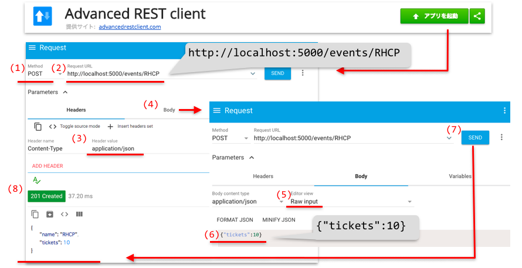

Akka in Action([Akka実践バイブル](https://www.shoeisha.co.jp/book/detail/9784798153278)) workshop
=================

This is a project for [Akka in Action workshop](http://2018.scalamatsuri.org/en/candidates/YugoMaede_1/) at Scala Matsuri 2018.

## The preparation

You can try creating an Akka application at this workshop, if you prepare the following tools.

### 1. Git

#### Install
https://git-scm.com/downloads

#### Checking your installation

```
git clone git@github.com:akka-ja/akka-in-action.git
```

### 2. sbt
#### Install
##### Mac
https://www.scala-sbt.org/0.13/docs/Installing-sbt-on-Mac.html

##### Windows
https://www.scala-sbt.org/0.13/docs/Installing-sbt-on-Windows.html

#### Checking your installation
You need execute the command on the same directory with executing the previous git command.

```
cd akka-in-action/chapter-up-and-running/
sbt run
```

### 3. The tool which send HTTP requests

You can ether use a CLI tool or a GUI tool.

#### (1) CLI tool: HTTPie

##### Install
https://httpie.org/doc#installation

##### Checking your installation

```
http POST localhost:5000/events/RHCP tickets:=10
```

#### (2) GUI tool: Advanced REST client
##### Install
https://chrome.google.com/webstore/detail/advanced-rest-client/hgmloofddffdnphfgcellkdfbfbjeloo

##### Checking your installation



* You can copy the followings
    * (2) http://localhost:5000/events/RHCP
    * (6) {"tickets":10}

### 4. IntelliJ IDEA(option)
##### Install
https://www.jetbrains.com/idea/download/


That's all for your preparation!


----

## The commands using this workshop

#### Run the app
```
git clone https://github.com/akka-ja/akka-in-action.git
```

```
cd akka-in-action/chapter-up-and-running/
sbt assembly
ls target/scala-2.12/goticks-assembly-1.0.jar
java -jar target/scala-2.12/goticks-assembly-1.0.jar
```

#### HTTP requests
```
http POST localhost:5000/events/RHCP tickets:=10
```

```
http GET localhost:5000/events
```

```
http POST localhost:5000/events/RHCP/tickets tickets:=2
```

```
http DELETE localhost:5000/events/RHCP/
```

### ex.0
```
git checkout matsuri
cd akka-in-action/chapter-up-and-running/
sbt run
```

### ex.1
```
sbt run
```

```
http POST localhost:5000/events/RHCP tickets:=10
```

### ex.2
```
sbt run
```

```
http POST localhost:5000/events/RHCP tickets:=10
http POST localhost:5000/events/RHCP/tickets tickets:=2
```

### ex.3
```
sbt run
```

```
http POST localhost:5000/events/RHCP tickets:=10
http POST localhost:5000/events/RHCP/tickets tickets:=2
http GET localhost:5000/events/
```

### ex.4
```
sbt run
```

```
http POST localhost:5000/events/RHCP tickets:=10
http POST localhost:5000/events/RHCP/tickets tickets:=2
http GET localhost:5000/events/
http DELETE localhost:5000/events/RHCP
```

### ex.5
```
brew install heroku
```

```
cd ..
heroku login
heroku create
git subtree push --prefix chapter-up-and-running heroku master
```
```
http POST aaa-bbb-0000.herokuapp.com/events/RHCP tickets:=250
http POST aaa-bbb-0000.herokuapp.com/events/RHCP/tickets tickets:=4
```

